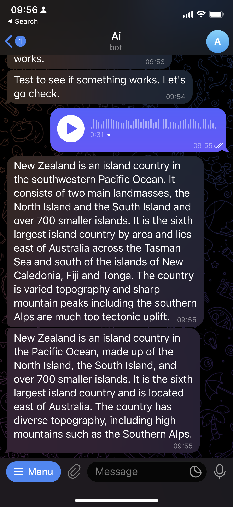

# Telegram AI Assistant

This is a simple Telegram bot built with Python.

## Getting Started

These instructions will get you a copy of the project up and running on your local machine for development and testing purposes.

### Prerequisites

You need to have Python installed on your machine. You can download it from [here](https://www.python.org/downloads/).

### Installing

1. Clone the repository
```
git clone <repository_url>
```
2. Install the dependencies
```
pip install -r requirements.txt
```
3. Update your env.py file with your token
You can find your token by craeting a new bot with [BotFather](https://t.me/botfather)

4. Run the bot
```
python main.py
```

## Built With

* [Python](https://www.python.org/) - The programming language used
* [Telegram](https://github.com/python-telegram-bot/python-telegram-bot) - The bot API used

## Resources
* [Getting started tutorial](https://github.com/python-telegram-bot/python-telegram-bot/wiki/Introduction-to-the-API) - simple quick start with the python library
* [Example project tutorial](https://github.com/python-telegram-bot/python-telegram-bot/wiki/Extensions---Your-first-Bot) - simple project


## Authors

* **Your Name** - *Initial work* - [YourGithubUsername](https://github.com/YourGithubUsername)

## License

This project is licensed under the MIT License - see the [LICENSE.md](LICENSE.md) file for details

## Screenshot



## Notes

## Pyhton debugging tool

```
import pdb; pdb.set_trace()
```

## To Do

- summarize youtube videos [done]
– generate audio [done]
– transcribe audio [done]
– Allow questions to be asked about the summary? [done]
– display the text summarised in a collapsable section [done]
- summarize youtube videos [done]
– record results in a database to get feedback
- change system command to user command to allow follow up questions to be mre than 2 sentences
– support answer with quotes if a users question is answered by the article
- Speed up program by skipping download audio file
- write test for view_source
- Enable bot to be used in group chats eg to transcribe audio for users who dont like voice messages
- Make the logger save to a file
- Use chunking to increase audio transciprtion length greater than 30s for whisper
- Send a mark down message as response to prettifiy the output